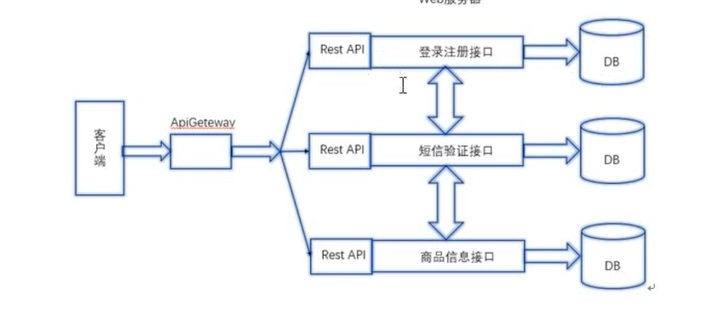

## 微服务架构

# 微服务特点

优势 独立性 技术灵活 高效团队

缺点 服务拆分 增加额外的工作
 

## RPC

服务端 server.go
```
package main

import (
	"log"
	"net/http"
	"net/rpc"
)

// 变量声明
type Rect struct {
}

type Params struct {
	Width  int
	Height int
}

// 定义求矩形的面积的方法 nil
func (r *Rect) Area(p Params, ret *int) error {
	*ret = p.Width * p.Height
	return nil
}

// 定义求矩形的周长的方法 返回nil
func (r *Rect) Perimeter(p Params, ret *int) error {
	*ret = 2 * (p.Width + p.Height)
	return nil
}

func main() {
	// 创建一个Rect对象
	rect := new(Rect)
	// 注册rect对象
	rpc.Register(rect)
	// 把服务处理绑定在http上
	rpc.HandleHTTP()
	// 监听服务
	err := http.ListenAndServe(":8080", nil)
  // 结果记录
	log.Println(err)

}

```
业务层 client.go
```
package main

import (
	"fmt"
	"log"
	"net/rpc"
)

type Params struct {
	Width  int
	Height int
}

func main() {
	// 连接远程服务
	rp, err := rpc.DialHTTP("tcp", "localhost:1234")
	if err != nil {
		log.Fatal(err)
	}
	// 调用远程方法
	// 定义接受服务端传回来的计算结构的变量
	var ret int
	err2 := rp.Call("Rect.Area", Params{50, 100}, &ret)
	if err2 != nil {
		log.Fatal(err2)
	}
	fmt.Println(ret)

	// 求周长的数据main
	err3 := rp.Call("Rect.Perimeter", Params{50, 100}, &ret)
	if err3 != nil {
		log.Fatal(err3)
	}
	fmt.Println(ret)
  }
```
# RPC的调用流程
  GO微服务架构下 数据交互是对内RPC 对外REST
  将业务拆分到各个微服务，具有提高项目协助的效率。
  
